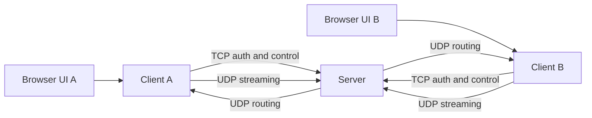

# Architecture

The application separates the browser UI, client network logic, server state, protocol encoding and cryptography.

The browser communicates only with its local client process. Client to server networking uses raw TCP and UDP sockets.
