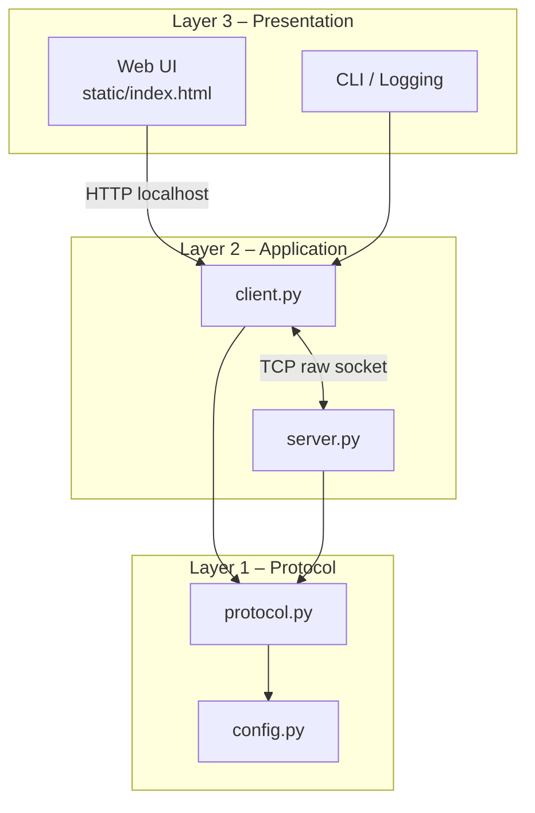
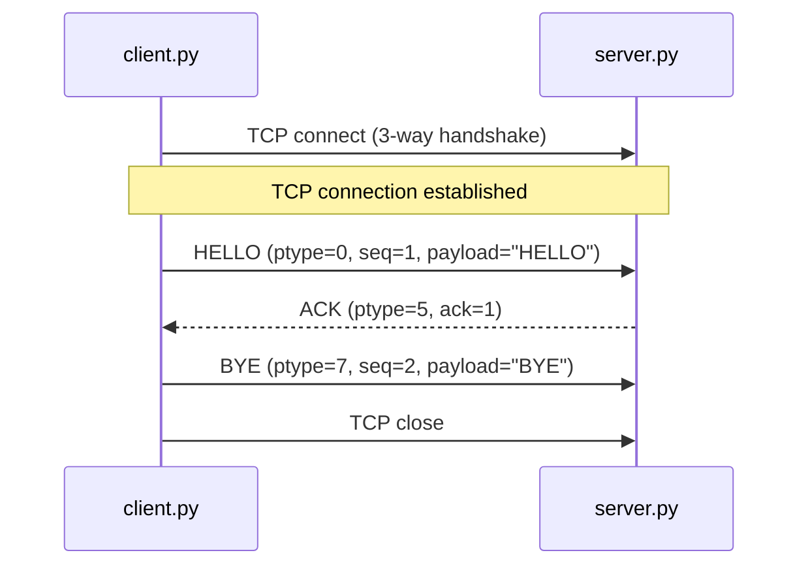
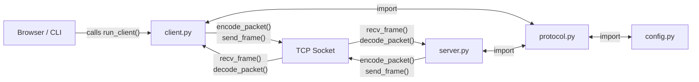

# System Architecture – Networking App Assignment

> **Scope:** Week 1 layers may be noted but not yet implemented.

---

## 1. Three-Layer Architecture

---

## 2. Sequence Diagram – W1 Handshake

---

## 3. Data Flow

---
