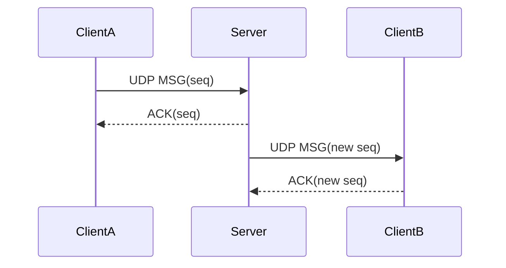
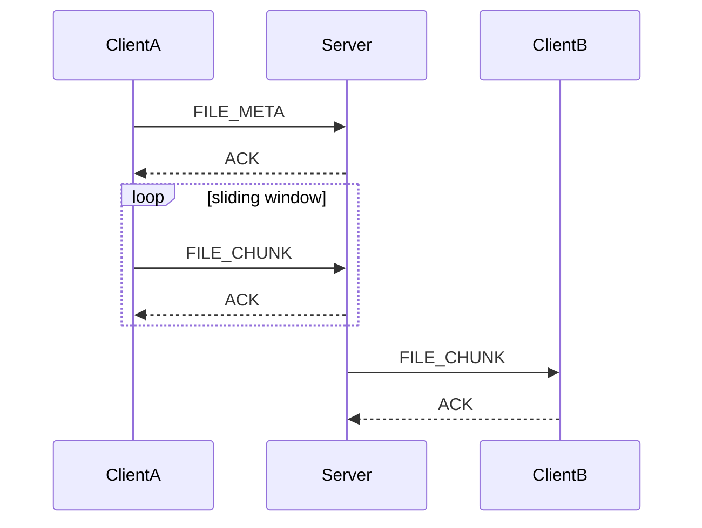

# Protocol Specification

Core collaboration traffic uses raw sockets.

- **TCP port 9000**: Control channel for server hello, authentication, and liveness. Uses length-prefix framing to preserve message boundaries over TCP byte streams.
- **UDP port 9001**: Data channel for heartbeat, user discovery, real-time messaging, and file chunk transfer with application-layer reliability.

## 1. TCP Framing (Length-Prefix)

TCP is a stream-oriented transport protocol with no built-in message boundaries. Without framing, consecutive writes can suffer from packet coalescing (sticky packets) or network fragmentation, causing multiple messages to merge or split across `recv()` calls.

To ensure deterministic message parsing, all control traffic over TCP is enclosed in a length-prefixed frame:

```
+------------------------+------------------------------------+
|  Length (4 bytes, !I)  |  Payload data (Length bytes)       |
+------------------------+------------------------------------+
```

- **Length prefix (4 bytes)**: Unsigned 32-bit integer in network byte order (Big-Endian, struct format `!I`). Specifies the exact length of the payload that follows.
- **Payload**: UTF-8 encoded JSON object (e.g. `HELLO`, `AUTH`, `AUTH_OK`, `PING`, `PONG`).
- **Framing mechanism**:
  - **Sender (`send_frame`)**: Computes `len(payload)`, packs the 4-byte header, and sends `header + payload` via `sendall()`.
  - **Receiver (`recv_frame`)**: Reads exactly 4 bytes using a looped `recv()` (`recv_exact`) to decode the expected payload size, then reads exactly that number of bytes before handing the buffer to the JSON decoder. Returns `None` on clean socket closure.

## 2. Packet Format (UDP / Core Protocol)

UDP datagrams share a fixed 37-byte binary header followed by a variable-length payload. Fields are encoded in network byte order (Big-Endian).

Struct format: `!2sBBB II 16s H H I` (Total header size: 37 bytes).

### Header Fields

| Field | Size | Type | Description | Example |
| --- | ---: | :---: | --- | --- |
| Magic | 2 bytes | `2s` | Protocol identifier, fixed to `NP` | `b"NP"` |
| Version | 1 byte | `B` (uint8) | Protocol version | `1` |
| Type | 1 byte | `B` (uint8) | Packet type identifier | `2` (`MSG`) |
| Flags | 1 byte | `B` (uint8) | Bitmask control flags | `1` (`FLAG_ENCRYPTED`) |
| Sequence number | 4 bytes | `I` (uint32) | Monotonically increasing packet sequence number | `1001` |
| Acknowledgment number | 4 bytes | `I` (uint32) | Sequence number being acknowledged | `1001` |
| Message ID | 16 bytes | `16s` | Unique UUID v4 for the message or file transfer session | `uuid4().bytes` |
| Chunk index | 2 bytes | `H` (uint16) | Current chunk sequence (0-indexed) | `0` |
| Total chunks | 2 bytes | `H` (uint16) | Total number of chunks in the transfer | `1` |
| Payload length | 4 bytes | `I` (uint32) | Size of payload data following the header (bytes) | `64` |

### Packet Types

| Value | Name | Description |
| :---: | --- | --- |
| 1 | `HEARTBEAT` | Client periodic presence signal (`{"username": "..."}`) |
| 2 | `MSG` | Real-time chat message (unicast / broadcast) |
| 3 | `FILE_META` | File transfer metadata (filename, size, checksum) |
| 4 | `FILE_CHUNK` | Raw binary chunk of a file |
| 5 | `ACK` | Acknowledgment packet carrying acknowledged sequence number |
| 6 | `USER_LIST` | Broadcast list of currently active users |

### Control Flags

| Bit | Name | Value | Description |
| :---: | --- | :---: | --- |
| 0 | `FLAG_ENCRYPTED` | `0x01` | Payload is encrypted with Fernet |
| 1 | `FLAG_END` | `0x02` | Marks final packet / end-of-transmission chunk |

Payloads with `FLAG_ENCRYPTED` set are encrypted using Fernet symmetric encryption before transmission.

Reliable UDP uses sequence numbers, ACKs, retransmission timeouts, and a sliding window.

## 3. Message Flow



## 4. File Flow


